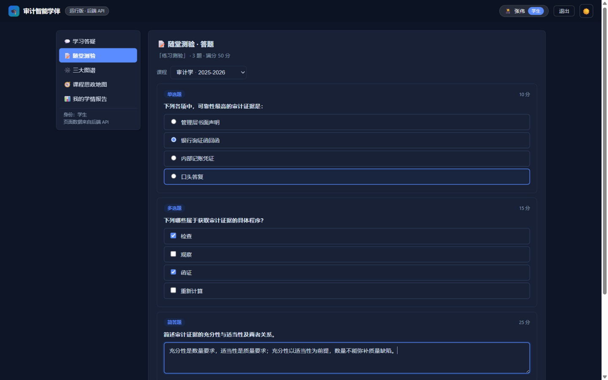
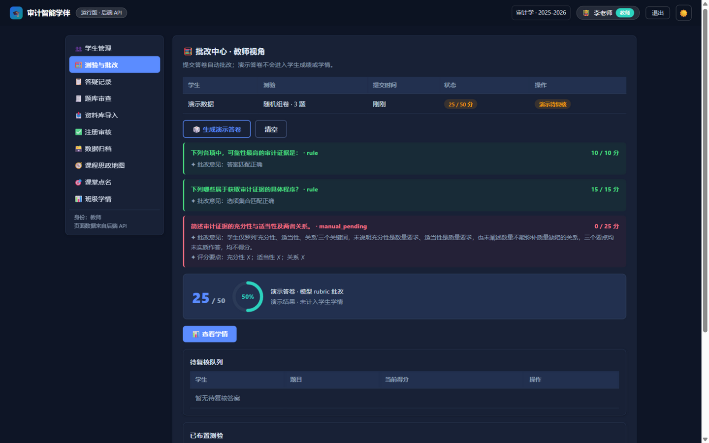

<div align="center">

# 🎓 审计智能学伴

**面向审计学课程的 AI 教学平台 · 答疑 · 测验 · 批改 · 学情**

基于知识库检索的智能答疑、随堂/布置测验、模型批改与教师复核、学情报告、题库与图谱管理，
单机即可运行，专为课堂并发场景打磨。

[](https://www.python.org/)
[](https://fastapi.tiangolo.com/)
[](server/tests/test_smoke.py)
[](#-测试与压测)
[](#-快速开始)

 

*学生答题（草稿自动保存）· 教师批改中心（规则判分 + 模型 rubric 批改）*

</div>

## ✨ 功能特性

| | 功能 | 说明 |
|---|---|---|
| 💬 | **知识答疑** | 本地 BM25 检索（422 份资料 → 20,258 知识块）+ 大模型，回答按「结论 → 准则依据 → 实务案例 → 思政启示 → 思维导图」结构生成，返回资料来源；未配置模型时自动降级 |
| 📝 | **随堂测验** | 按课程/章节/难度随机组卷，单选、多选、判断、填空、简答、案例六种题型；**作答草稿自动保存，刷新/重启均可恢复** |
| 🧮 | **智能批改** | 客观题规则即时判分；简答与案例题由模型按 rubric 逐要点评分并给出批改意见，未达标进入教师复核队列 |
| 👥 | **师生协同** | 学生自助注册（课堂代码）、教师审核、测验布置与截止追踪、学情报告与 Excel 导出 |
| 🗺️ | **三大图谱** | 知识 / 胜任力 / 问题图谱，节点映射与掌握度追踪 |
| 🔐 | **会话安全** | HttpOnly Cookie 会话、Argon2 密码、失败锁定、角色强校验、同源写保护、审计日志 |
| 🤖 | **多通道模型池** | 学生 / 教师 / 批改通道独立分流 Key，主备自动切换（真实演练验证），RPM/TPM 令牌桶限流 |

## 🚀 快速开始

```powershell
git clone https://github.com/KROZ-coding/audit-companion.git
cd audit-companion/server
python -m venv .venv
.\.venv\Scripts\python.exe -m pip install -r requirements.txt
.\.venv\Scripts\python.exe -m uvicorn app.main:app --host 127.0.0.1 --port 8000
```

打开 <http://127.0.0.1:8000/> ，开发种子账号 `stu001 / stu123*`（学生）、`teacher01 / teach123*`（教师）。
Windows 下也可双击根目录 `start_audit_companion.bat` 一键启动。

配置模型：复制 `server/.env.example` 为 `server/.env` 填入 OpenAI 兼容端点即可；
不配置则答疑 / 批改 / 学情回退规则模式，其余功能不受影响。
重建知识索引：`server/build_knowledge_index.py "审计学知识库目录"`（语料不入库，另行准备）。

<details>
<summary><b>模型通道池配置（师生批改分池 + 主备切换 + 限流）</b></summary>

```ini
# server/.env —— Key 通过 api_key_env 指向环境变量，绝不写入 JSON 或提交
LLM_STUDENT_PRIMARY_KEY=sk-xxx
LLM_STUDENT_BACKUP_KEY=sk-xxx
LLM_TEACHER_KEY=sk-xxx
LLM_GRADING_KEY=sk-xxx
LLM_PROVIDERS_JSON=[{"name":"student-primary","channel":"student","base_url":"https://relay.example/v1","api_key_env":"LLM_STUDENT_PRIMARY_KEY","model":"glm-5.3-flash","max_concurrency":16,"queue_size":60,"priority":10,"rpm_limit":0,"tpm_limit":0},{"name":"student-backup","channel":"student","base_url":"https://relay.example/v1","api_key_env":"LLM_STUDENT_BACKUP_KEY","model":"glm-5.3-flash","max_concurrency":16,"queue_size":30,"priority":20},{"name":"teacher-main","channel":"teacher","base_url":"https://relay.example/v1","api_key_env":"LLM_TEACHER_KEY","model":"glm-5.3-flash","max_concurrency":4,"queue_size":10,"priority":10}]
```

每端点独立并发上限与排队，429/5xx 自动冷却并按 `Retry-After` 等待，主通道失败自动切换备用通道；
`rpm_limit` / `tpm_limit`（0 为不限）按供应商真实额度配置令牌桶。
逐通道真实验证：`python verify_llm_channels.py`，备用切换演练见脚本 `--pool` 与 `--set-env` 参数。

</details>

## 🧪 测试与压测

```powershell
cd server
.\.venv\Scripts\python.exe -m unittest discover -s tests -p "test_smoke.py"   # 85 项后端测试
.\.venv\Scripts\python.exe verify_llm_channels.py                             # 通道池逐端点真实验证
.\.venv\Scripts\python.exe load_test.py --users 60 --scenario mixed           # 60 人混合压测
```

`load_test.py` 自动起独立临时数据的 uvicorn 实例、预置 N 个学生账号，跑完自动清理；
支持 `mixed / objective / subjective / ask` 场景与 `--no-knowledge`（隔离模型链路）、`--json` 报告。

60 人真实压测（登录 + 知识答疑 + 客观测验，真实模型调用）：

| 指标 | 结果 |
|---|---|
| 登录 | 60/60 成功 · p50 **1.7s** · p95 8.8s |
| 答疑 | 60/60 成功 · **100% 命中知识库** · degraded 0 |
| 客观测验 | 60/60 成功 · p50 0.1s |
| 主观批改（10 人） | 10/10 模型批改完成 · p50 9.1s |

## 📁 目录结构

```
audit-companion/
├── server/                    # FastAPI 后端
│   ├── app/                   # 路由、服务、模型、存储
│   ├── tests/                 # 85 项冒烟与单元测试
│   ├── verify_llm_channels.py # 模型通道真实验证
│   ├── load_test.py           # 可复用 HTTP 压测
│   └── build_knowledge_index.py
├── 智能学伴演示页.html          # 单文件前端（学生/教师/管理员）
├── 课程思政地图.html            # 思政地图（vendor/d3 本地化）
└── start_audit_companion.*    # 一键启动脚本
```

## 🗺️ Roadmap

- [ ] 按供应商真实 RPM/TPM 额度配置令牌桶参数
- [ ] 60 人主观题批改完整压测
- [ ] 多进程 / 多实例部署的 SQLite 迁移
- [ ] 浏览器级退出与恢复作答自动化测试

---

<div align="center">

**审计智能学伴** · 经管数智审计课程建设配套 · 单机演示与校内教学场景

</div>
